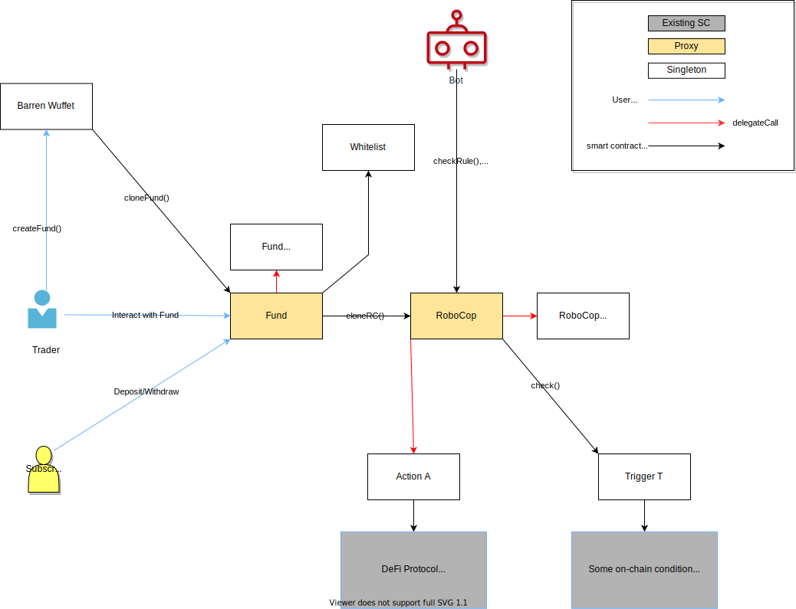

# Architecure

## Barren Wuffet

This contract allows anyone (ie. a "fund manager") to create a `Fund` with custom parameters. After a `Fund` is deployed, the fund manager interacts directly with the `Fund` contract to manage the fund. The fund also comes with its own instance of `RoboCop` contract which allows the fund manager to set up trading rules.

## Fund

A `Fund` is a proxy pointing to a singleton `FundImplementation` deployed on chain. This is done using the [`clone()` functionality of ERC1167](https://blog.openzeppelin.com/workshop-recap-cheap-contract-deployment-through-clones/)

Subscribers to the fund can deposit their ETH before `subscriptionConstraints.deadline`, given they pass the other capital constraints set by the manager at the time of creation.

Subscribers can withdraw their collateral before the fund is deployed, or take out their share of the assets remaining in the fund (minus management fees specified as `subscriberToManagerFeePercentage`) after `subscriptionConstraints.lockin`. Note that this only applies to ERC20 tokens and ETH, as NFTs are not divisible. See the section on `Position` to understand how we deal with NFTs.

Fund Manager can take Actions (Whitelisted only), or setup IFTTT-style rules using its own RocoCop (ERC1167 proxy again).

Fund Manager can withdraw their fees after `lockin`, given they have have closed all active Positions.

## RoboCop

RoboCop is an on-chain rules engine. The basic unit of work in the RoboCop is a rule, which is made of Triggers and Actions. RoboCop allows anyone (typically mev bots, Gelato bots or even Chainlink keepers) to call the contract to execute action on behalf of the user if a certain trigger is met. The bot can get a reward if the rule gets executed successfully.

If more than 1 Trigger is specified in a rule, ALL of triggers must return true in the same transaction before any action can be taken. If the set of triggers fail, the entire tx will be reverted.

If more than 1 Action is specified in a Rule, all of them will be executed sequentially (outputs of A flowing as inputs to A+1).

### WhitelistService

For now, both Triggers and Actions have a whitelist (maintained by a global `WhitelistService` contract) to reduce the attack surface. The eventual goal is to allow anyone to add new triggers and actions (following the ITrigger and IAction interfaces) so they can make custom rules for automating arbitrary operations.

### Triggers

Triggers follow the ITrigger interface.

When creating rules, the triggers must return `true` when `validate()` is called to ensure the parameters given make sense for the particular trigger.

Triggers return `true` or `false` when `check()` is called. It also returns `TriggerReturn`(consisting of Type and Bytes), which may be decoded and used by other parts of the code that are trigger-aware.

Each Trigger is a singleton on-chain.

Example Triggers are:

- Chainlink price feeds
- Timestamp triggers (rough estimate only)

### Actions

Actions follow the IAction interface and **must not include any storage state**.

When creating rules, the action must return `true` when `validate()` is called to ensure the parameters given make sense for the particular action.

The `perform()` function is called on an action via a `delegateCall` (which is why they can't use storage). This returns `ActionResponse` which consists of output `Tokens` (ERC20 / ETH / ERC721) and `Positions` (more on this later).

Example Actions include defi transactions (swaps, providing liquidity, buying options).

### Positions

Some Actions are straightforward and one-shot give and take. For example, give uniswap X amount of Token A and it will return Y amount of Token B.
However, some Actions are more complicated and require something akin to a `close()` operation. For example, if you LP on uniswap, you get an NFT that you have to return to get your initial capital back (and you can collect LP rewards as long as you hold the NFT).
Furthermore, some actions can be "closed" in multiple ways. To capture this workflow, Actions return `Position` (which is a list of possible Actions that one might take to close the position created by the initial Action). These possible Actions are hashed and kept by the Fund and RoboCop. If ANY of those Actions are called, the corresponding `Position` is considered closed.

Fund and RoboCop maintain separate lists of Positions because positions are typially context dependent [ie. the Fund contract cant close a position that RoboCop created].

We dont prevent multiple positions from returning the same action. If 2 actions both return `[Action A]` as the position, they are both considered as being the same positon. The fund will only track 1 position in this case, which will be closed by performing `Action A`. However, if `Action 1` returns `[Action X, Action Y]`. And `Action 2` returns `[Action X, Action Z]`, these are stored as 2 different positions. Performing `Action X` will close both positions, while performing `Action Y` or `Action Z` will only close one of the positions.

An action defined in a position can also subsequenty return a `Position` when called, essentially encoding a state machine as a sequence of actions.

To save on storage, `Fund` and `RoboCop` do not store the details of the position itself. They only store a todo list of hashes of pending positions (so we know for example, whether the fund can be closed). To close the position, the corresponding action and all of its details needs to be provided by the user (directly via `takeAction` in a Fund; By adding a rule to a RoboCop).

## Fees

Barren Wuffet takes subscriberToPlatformFeePercentage of every deposit from subscribers (denominated in ETH).
Barren Wuffet takes managerToPlatformFeePercentage from `takeAction::action.inputTokens`/`createRule::actions[0].inputTokens`, but ignores ERC721 tokens.
Manager takes subscriberToManagerFeePercentage from the output of the fund (given all positions are closed and fund was not closed prematurely).
